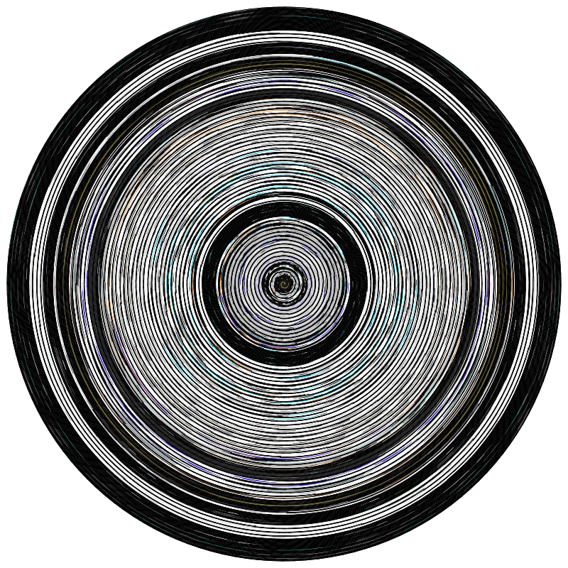
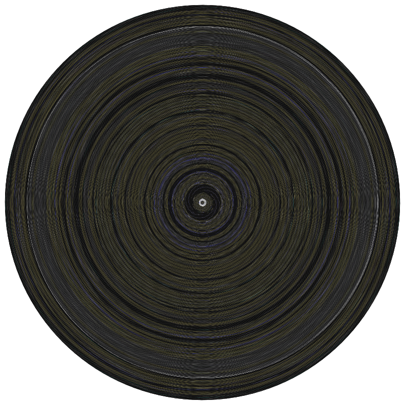
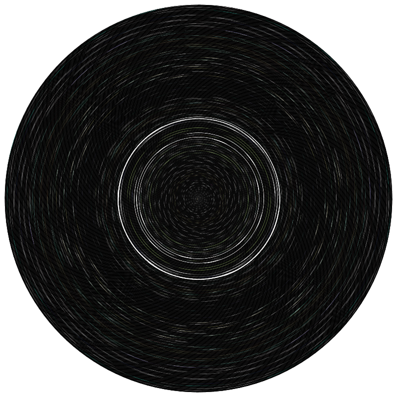

# PYTCHI

**P**ython **Y**ou**T**ube **C**oncentric **C**ircles **I**mage

> _You_ Huh?? No **H** in pytcci?
>
> _Me_ Are you serious?


## Installation

`pip3 install pytchi`

_Dependancies:_

- `opencv-python-headless`
- `pycairo`
- `python-slugify`
- `pytube`


## Usage

Following console code produces:

- a PNG image from [this
  video](https://www.youtube.com/watch?v=IjxkCokODEs) then replaces
  it with a fixed width 1080px image ;
- a SVG image from [this
  video](https://www.youtube.com/watch?v=PVyS9JwtFoQ) using 1 image
  every 2 seconds and then cleans for it only remains the final image
- 3 PNG images from [this
  playlist](https://www.youtube.com/playlist?list=PLZHQObOWTQDOcxqQ36Vow3TdTRjkdSvT-)
  using `random` line extraction instead of `diagonal`
  (default). Note that URL has just to contain a `list` variable so
  that `pytchi` produces an image for each video of that playlist.

```python3

>>> import pytchi
>>> o = pytchi.pytchi('https://www.youtube.com/watch?v=IjxkCokODEs')
>>> o.to_img() # export to png
>>> o.to_img(1080) # or with desired image's dimension
>>> p = pytchi.pytchi('https://www.youtube.com/watch?v=PVyS9JwtFoQ')
>>> p.step = 2 # every 2 seconds of the video (default is 1)
>>> p.to_svg() # export to svg
>>> p.clean(all) # deletes temporary files so that p object is unsable now!
>>> q = pytchi.pytchi('https://www.youtube.com/watch?v=gxAaO2rsdIs&list=PLZHQObOWTQDOcxqQ36Vow3TdTRjkdSvT-&index=2')
>>> q.xmth = 'random'
>>> q.to_img(800)

```

## Outputs

- [IjxkCokODEs](https://www.youtube.com/watch?v=IjxkCokODEs)

</img>

- [PVyS9JwtFoQ](https://www.youtube.com/watch?v=PVyS9JwtFoQ)

</img>

- [D__UaR5MQao](pytchi-d-uar5mqao-the-dp-3t-algorithm-for-contact-tracing-via-nicky-case.png) / [gxAaO2rsdIs](pytchi-gxaao2rsdis-simulating-an-epidemic.png) / [Kas0tIxDvrg](pytchi-kas0tixdvrg-exponential-growth-and-epidemics.png)

</img>
</img>
</img>

## Copyright

2021 / D. COBAC / CC-BY-NC-SA
