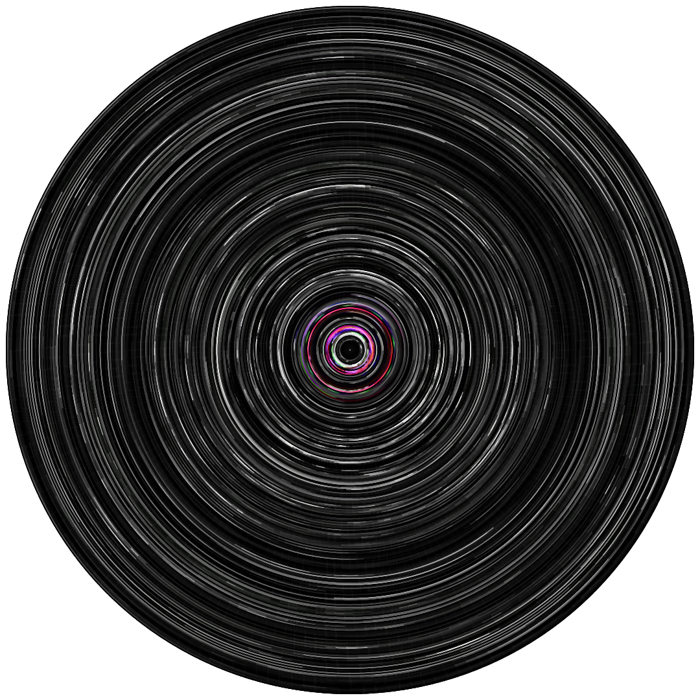

# pytci

**P**ython **Y**ou**T**ube concentric **C**ircles **I**mage

## usage

```python
>>> import pytci
>>> o = pytci.pytci('https://www.youtube.com/watch?v=IjxkCokODEs')
>>> o.to_img() # export to png
>>> o.to_img(1080) # or with desired image's dimension
>>> p = pytci.pytci('https://www.youtube.com/watch?v=PVyS9JwtFoQ')
>>> p.step = 2 # every 2 seconds of the video (default is 1)
>>> p.to_svg() # export to svg
```

## example

[IjxkCokODEs](https://www.youtube.com/watch?v=IjxkCokODEs)
</img>

[PVyS9JwtFoQ](https://www.youtube.com/watch?v=PVyS9JwtFoQ)
</img>
